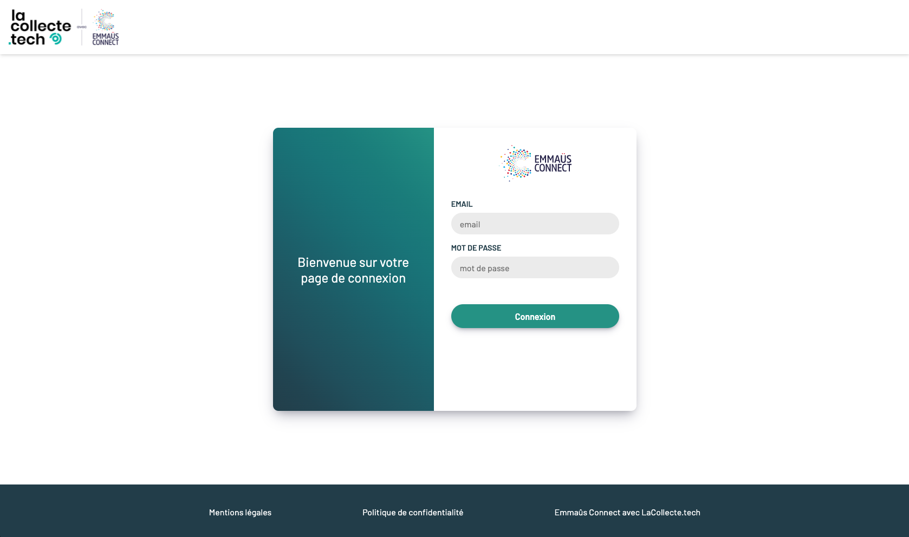

Fullstack project done during our developer web studies at Wild Code School in partnership with Emmaüs. We had two days to work on this project in "Hackathon" mode, with a team of five members.

Emmaüs Connect works daily on digital inclusion.

Emmaüs Connect sells electronic devices and in particular smartphones to meet this need.

The objective is to develop a smartphone classification tool in order to generate a selling price according to their characteristics (RAM, storage, etc.).

